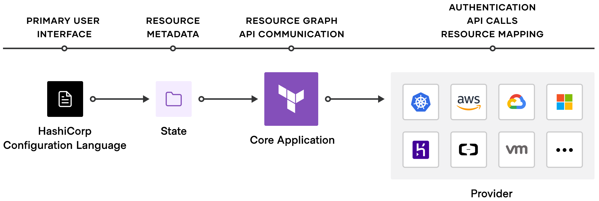

<h2> Hello , and welcome to my space</h2>

 
 

## The Deets

#### 👉 Available for consultation via the [AWS IQ](https://iq.aws/e/bryantbiggs) or direct C2C 🚀

### Who I am

An engineer passionate about cloud infrastructure, serverless technologies, and helping folks create secure, scalable infrastructure

### What I do

Helping teams create secure, scalable infrastructure following modern cloud native practices at [Clowd Haus](https://github.com/clowdhaus) (pronounced ☁️ 🏠)! You can also find me contributing back to open source projects like [Terraform AWS Modules](https://github.com/terraform-aws-modules) and [Terraform provider AWS](https://github.com/hashicorp/terraform-provider-aws)

### Why you should reach out

- You are looking for help building out your AWS environment following the [Well-Architected Framework](https://docs.aws.amazon.com/wellarchitected/latest/framework/welcome.html)
- You want to adopt infrastructure as code within your team and could use some assitance with Terraform, IaC standards, practices, and conventions
- You are interested in building out and adopting a serverless architecture on AWS for scalability
- Help with any combination of the above points - AWS, Terraform, infrastructure as code, cloud native, serverless `#allTheThings`

<!-- Just a hack for a thin line  -->
##

If you like or enjoy what I do, maybe you'd be kind enough to sponsor 😬

