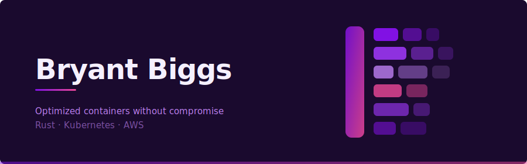

  

  
  
  
  

I build the infrastructure tools that teams use to run Kubernetes and AI/ML workloads on AWS. Most of my work lives in the open — if you've deployed EKS or VPC resources with Terraform, there's a good chance you've used something I've built or maintain.

---

<table>
<tr>
<td align="center"><h3>1.77B+</h3>Terraform Registry downloads</td>
<td align="center"><h3>17,600+</h3>GitHub stars across maintained modules</td>
<td align="center"><h3>60+</h3>Terraform modules maintained</td>
<td align="center"><h3>900+</h3>merged PRs in terraform-aws-modules</td>
</tr>
</table>

## What I'm Known For

I'm a core maintainer of [terraform-aws-modules](https://github.com/terraform-aws-modules) — the most widely adopted Terraform modules for AWS, covering everything from EKS and VPC to Lambda, RDS, IAM, and dozens more. I created 20+ of those modules from scratch.

[terraform-aws-eks](https://github.com/terraform-aws-modules/terraform-aws-eks) (4,900+ stars) is the one I'm most known for — it's how most teams provision and manage their EKS clusters. I also contribute upstream to [kubernetes-sigs](https://github.com/kubernetes-sigs) projects like [Karpenter](https://github.com/aws/karpenter-provider-aws), [aws-iam-authenticator](https://github.com/kubernetes-sigs/aws-iam-authenticator), and others.

## Where I'm Focused Now

I'm working on something new — a ground-up rethink of how container images are built, distributed, and run. The format, the developer tooling, security, reproducibility, all of it. The easiest way to build the most performant and efficient container images. Tar was designed for tape drives in 1979; containers, and developers, deserve better. Much better.

## Rust

Terraform got me here, but Rust is where I'm headed. I use it to build the kind of infrastructure tooling that needs to be fast, correct, and small enough to ship anywhere — from CLI tools to container runtimes to node-level agents.

What I've built:

- **[eksup](https://github.com/clowdhaus/eksup)** — analyzes running EKS clusters for upgrade readiness: deprecated APIs, compatibility issues, the works
- **[cookiecluster](https://github.com/clowdhaus/cookiecluster)** — interactive CLI that generates production EKS Terraform definitions without needing AWS credentials
- **[eksnode](https://github.com/clowdhaus/eksnode)** — EKS node bootstrap interface, cross-compiled to static Linux binaries with containerd gRPC integration (predates AWS's own `nodeadm` for the EKS AMI)
- **[ktime](https://github.com/clowdhaus/ktime)** — measures pod startup latency from apply to ready

Where I contribute upstream:

- **[containerd/rust-extensions](https://github.com/containerd/rust-extensions)** — protobuf definitions, dependency hygiene, workspace standardization
- **[opentelemetry-rust](https://github.com/open-telemetry/opentelemetry-rust)** — performance in the metrics hot path, spec compliance, fixing exporter deadlocks on constrained tokio runtimes

## AI/ML Infrastructure

I've spent a lot of time making it practical to run GPU and accelerator workloads on Kubernetes:

- NVIDIA Triton, vLLM, and NVFlare deployments on EKS
- AWS Inferentia/Trainium scheduling with Neuron device plugins
- EFA networking for distributed training
- Container image caching for 20GB+ ML images
- Karpenter autoscaling for heterogeneous GPU fleets

Much of this lives in [EKS Blueprints](https://github.com/aws-ia/terraform-aws-eks-blueprints) (3,000+ stars) where I was a core maintainer.

## Support My Work

If these tools save your team time, consider [sponsoring my work](https://github.com/sponsors/bryantbiggs). Sponsorship directly funds continued maintenance of 60+ Terraform modules, new Rust infrastructure tools, and upstream contributions to projects like Karpenter, containerd, and OpenTelemetry.

---

Chicago · [clowd.haus](https://clowd.haus)
